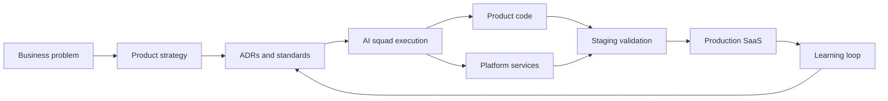

<div align="center">


<br />
<br />

[](https://www.fernandoparreiras.com.br)
[](https://trustyu.ai)
[](https://por.life)
[](https://github.com/TECH-HUMAN)
[](https://www.linkedin.com/in/fernandoparreiras)

</div>

---

## Faith, Work, and Purpose

I am a Christian. I believe Jesus Christ is my only Savior, the center of my life, my family, and the work I build.

Through [POR.life](https://por.life), every business and initiative I lead is aligned with a simple conviction: Jesus is at the center. He is the true CEO over purpose, strategy, execution, ethics, people, and impact.

> Though thy beginning was small, yet thy latter end should greatly increase.
>
> **Job 8:7**

> And whatsoever ye do, do it heartily, as to the Lord, and not unto men.
>
> **Colossians 3:23**

---

## Platform Stack

### Product Foundation


### Backend, Data, and Infra


### AI, Agents, and LLM Tooling


---

## Builder Signal

I am a founder and AI systems architect building companies, products, and operating systems around applied artificial intelligence.

My current work connects **Trustyu.ai**, **needyu.ai**, **Tech Human**, and **JARVIS** into a practical ecosystem: AI-native products, serious infrastructure, business automation, and human-centered adoption.

| Domain | Founder/AI Expert focus |
| --- | --- |
| Trustyu.ai | AI-powered vertical SaaS, Hub Agents, CRM vNext, BMAI, trust systems, and operational intelligence |
| needyu.ai | Digital products, cloud infrastructure, AWS/Terraform automation, platform services, and applied AI delivery |
| JARVIS | My AI product launch operating system: ADRs, agent squads, empirical validation, and repeatable execution |
| Tech Human | Humanized technology, AI literacy, governance readiness, leadership, and real-world business transformation |
| AI architecture | Multi-agent workflows, RAG, LLM routing, tracing, evaluation, tenant isolation, and human-in-the-loop systems |

## JARVIS

JARVIS is my product launch operating system: a way to move from idea to production SaaS with AI-assisted squads, documented architecture decisions, empirical validation, and cross-repo execution.



Core principles:

- Documents that operate like execution systems, not static notes
- Platform inheritance: decisions made once, reused across products
- Contract-first delivery with tests, smoke checks, and explicit release criteria
- Multi-agent collaboration between Claude, Claude Code, Codex, and other coding agents
- Empirical validation over assumptions, especially for infra, auth, LLM, and observability layers

## Stack Philosophy

I use a pragmatic, production-minded stack: simple enough to ship fast, structured enough to scale across products.

| Layer | Stack |
| --- | --- |
| Product foundation | Next.js 16, TypeScript, React, shadcn/ui, Tailwind CSS, pnpm |
| AI backend | Python 3.12+, FastAPI, Pydantic, SQLAlchemy, Alembic, pytest |
| Data and infra | PostgreSQL + pgvector, Redis, Docker, Keycloak, GitHub Actions |
| Cloud platform | AWS, Terraform/HCL, CI/CD automation, production operations |
| Agent tooling | Claude, Claude Code, Codex, OpenAI, Gemini, LangGraph, LangChain, LangSmith, LangFuse |

## AI Architecture Rules I Use

I do not start with the most complex agent framework. I start with the simplest layer that solves the problem, then move up only when the system asks for it.

- Direct SDK for classification, extraction, generation, streaming, and short prompt chains
- LangChain for RAG, retrievers, document pipelines, chunking, embeddings, and vector search
- LangGraph for stateful agents, conditional workflows, checkpointing, and handoffs
- Google ADK for parent-child hierarchies, parallel fan-out, and multi-agent consolidation
- Anthropic Agent SDK for high-autonomy Claude-native agents, coding automation, and deep research

## Multi-Agent Operating Model

I use AI agents as an execution layer, not as a novelty layer. The goal is simple: faster product iteration with stronger engineering discipline.

- Named branches and explicit ownership to prevent parallel AI sessions from colliding
- ADRs for architecture so decisions live in the system, not only in chat history
- RED/GREEN commits for contract-first implementation and reviewable progress
- Tenant isolation checks because vertical SaaS must be safe by default
- Observability on agents so AI behavior becomes debuggable traces
- Secrets treated as operational risk, not convenience

## Active Building Themes

- **Vertical SaaS:** repeatable product architecture for niche, high-context markets
- **AWS Infrastructure:** cloud architecture, automation, HCL/Terraform, CI/CD, and production operations
- **Hub Agents:** shared AI engine with vertical isolation and reusable agent infrastructure
- **Trustyu CRM:** AI-assisted CRM workflows, onboarding, messaging, and operational automation
- **AI Literacy:** governance readiness, use-case mapping, maturity models, and ROI frameworks
- **Humanized Technology:** systems that increase leverage without losing human judgment

## Contribution Flow

<picture>
  <source media="(prefers-color-scheme: dark)" srcset="https://raw.githubusercontent.com/fernandoparreiras/fernandoparreiras/output/github-contribution-grid-snake-dark.svg" />
  <source media="(prefers-color-scheme: light)" srcset="https://raw.githubusercontent.com/fernandoparreiras/fernandoparreiras/output/github-contribution-grid-snake.svg" />
  
</picture>

## Operating Principles

```text
Build useful things.
Make technology more human.
Turn complex systems into practical leverage.
Validate reality before scaling opinion.
```
