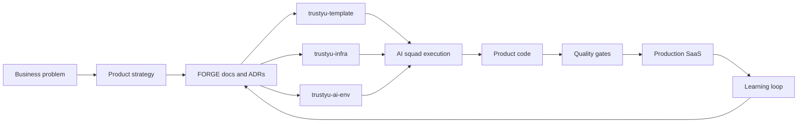

<div align="center">


<br />
<br />

[](https://www.fernandoparreiras.com.br)
[](https://trustyu.ai)
[](https://forge.trustyu.ai)
[](https://por.life)
[](https://techhuman.com.br)
[](https://www.linkedin.com/in/fernandoparreiras)

</div>

---

## Faith, Work, and Purpose

I am a Christian. I believe Jesus Christ is my only Savior, the center of my life, my family, and the work I build.

Through [POR.life](https://por.life), every business and initiative I lead is aligned with a simple conviction: Jesus is at the center. He is the true CEO over purpose, strategy, execution, ethics, people, and impact.

> Though thy beginning was small, yet thy latter end should greatly increase.
>
> **Job 8:7**

> And whatsoever ye do, do it heartily, as to the Lord, and not unto men.
>
> **Colossians 3:23**

---

## Platform Stack

### Product Foundation


### Backend, Data, and Infra


### AI, Agents, and LLM Tooling


### Quality, Security, and Delivery


---

## Builder Signal

I am a founder and AI systems architect building companies, products, and operating systems around applied artificial intelligence.

My current work connects [Trustyu.ai](https://trustyu.ai), [Trustyu FORGE](https://forge.trustyu.ai), [POR.life](https://por.life), [Tech Human](https://techhuman.com.br), and the [needyuai](https://github.com/needyuai) engineering ecosystem into a practical operating system for AI-native products, serious infrastructure, business automation, and human-centered adoption.

| Domain | Founder/AI Expert focus |
| --- | --- |
| [Trustyu.ai](https://trustyu.ai) | Vertical AI products, Hub Agents, CRM vNext, BMAI, trust systems, and operational intelligence |
| [Trustyu FORGE](https://forge.trustyu.ai) | AI-first engineering framework: ADRs, templates, reusable CI/CD, local AI environment, agent squads, and quality gates |
| [Tech Human](https://techhuman.com.br) | Humanized technology, AI literacy, governance readiness, leadership, and real-world business transformation |
| [POR.life](https://por.life) | Faith-led initiative where Jesus is at the center of purpose, ethics, business, and impact |
| AI architecture | Multi-agent workflows, RAG, LLM routing, tracing, evaluation, tenant isolation, and human-in-the-loop systems |

## Trustyu FORGE

[Trustyu FORGE](https://forge.trustyu.ai) is the AI-first engineering framework behind the Trustyu ecosystem. It turns product ideas into production SaaS through documented decisions, reusable templates, shared infrastructure, local AI engineering environments, agent squads, and empirical validation.

Public references: [FORGE Framework](https://forge.trustyu.ai), [Definition of Done](https://forge.trustyu.ai/#dod), [AI Squad](https://forge.trustyu.ai/#ia-squad), [Security](https://forge.trustyu.ai/#seguranca), and [Market Thesis](https://forge.trustyu.ai/#mercado).

| FORGE layer | Repository | Role |
| --- | --- | --- |
| Knowledge OS | `trustyu-docs` | ADRs, engineering standards, business strategy, runbooks, and agent methodology |
| Product template | `trustyu-template` | Base implementation for new Trustyu products: Next.js 16, TypeScript, Prisma, i18n, tests, CI, and design system |
| Platform infra | `trustyu-infra` | Reusable GitHub Actions, CI/CD, Docker Compose, Keycloak, bootstrap scripts, and shared automation |
| AI dev environment | `trustyu-ai-env` | Developer workstation, MCP setup, dotfiles, Codex/Claude kit, secrets workflow, and AI-first engineering tooling |



Core principles:

- Documents that operate like execution systems, not static notes
- Framework inheritance: decisions, templates, workflows, and environments reused across products
- Contract-first delivery with tests, smoke checks, and explicit release criteria
- Multi-agent collaboration between Claude, Claude Code, Codex, CodeRabbit, and other coding agents
- Empirical validation over assumptions, especially for infra, auth, LLM, and observability layers

## Stack Philosophy

I use a pragmatic, production-minded stack: simple enough to ship fast, structured enough to scale across products.

| Layer | Stack |
| --- | --- |
| Product foundation | Next.js 16, TypeScript, React, shadcn/ui, Tailwind CSS, pnpm 11 |
| AI backend | Python 3.12+, FastAPI, Pydantic, SQLAlchemy, Alembic, uv, pytest |
| Data and infra | PostgreSQL 18 + pgvector, Redis 8.2, Docker, Keycloak 25, GitHub Actions |
| Cloud platform | AWS, Terraform/HCL, Railway, Vercel, reusable CI/CD, production operations |
| Agent tooling | Claude, Claude Code, Codex, OpenAI, Gemini, MCP, LangGraph, LangChain, LangSmith, LangFuse |

## AI Architecture Rules I Use

I do not start with the most complex agent framework. I start with the simplest layer that solves the problem, then move up only when the system asks for it.

- Direct SDKs for classification, extraction, generation, streaming, and short prompt chains
- LangChain for RAG, retrievers, document pipelines, chunking, embeddings, and vector search
- LangGraph for stateful agents, conditional workflows, checkpointing, and handoffs
- Google ADK for parent-child hierarchies, parallel fan-out, and multi-agent consolidation
- Anthropic Agent SDK for high-autonomy Claude-native agents, coding automation, and deep research

## Multi-Agent Operating Model

I use AI agents as an execution layer, not as a novelty layer. The goal is simple: faster product iteration with stronger engineering discipline.

- Named branches and explicit ownership to prevent parallel AI sessions from colliding
- ADRs for architecture so decisions live in the system, not only in chat history
- RED/GREEN commits for contract-first implementation and reviewable progress
- Human review + AI review signal so delivery speed does not remove engineering judgment
- Tenant isolation, SAST, smoke tests, and quality gates because vertical SaaS must be safe by default
- Observability on agents so AI behavior becomes debuggable traces, not folklore
- Secrets treated as operational risk, not convenience

## Active Building Themes

- **Vertical SaaS:** repeatable product architecture for niche, high-context markets
- **Trustyu FORGE:** AI-first framework for reusable product delivery, standards, templates, infra, and agent execution
- **AWS Infrastructure:** cloud architecture, automation, HCL/Terraform, CI/CD, and production operations
- **Hub Agents:** shared AI engine with vertical isolation and reusable agent infrastructure
- **Trustyu CRM:** AI-assisted CRM workflows, onboarding, messaging, and operational automation
- **AI Literacy:** governance readiness, use-case mapping, maturity models, and ROI frameworks through [Tech Human](https://techhuman.com.br)
- **Faith and purpose:** businesses and products aligned under [POR.life](https://por.life), with Jesus at the center
- **Humanized Technology:** systems that increase leverage without losing human judgment

## Contribution Flow

<picture>
  <source media="(prefers-color-scheme: dark)" srcset="https://raw.githubusercontent.com/fernandoparreiras/fernandoparreiras/output/github-contribution-grid-snake-dark.svg" />
  <source media="(prefers-color-scheme: light)" srcset="https://raw.githubusercontent.com/fernandoparreiras/fernandoparreiras/output/github-contribution-grid-snake.svg" />
  
</picture>

## Operating Principles

```text
Build useful things.
Make technology more human.
Turn complex systems into practical leverage.
Validate reality before scaling opinion.
```
