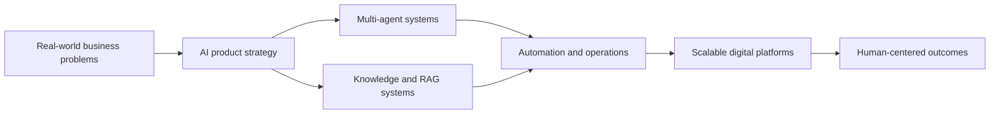

<div align="center">

# Fernando Parreiras

### AI Systems Architect | Founder @ Trustyu.ai & Tech Human

Building AI-powered systems, products, and infrastructure that solve real-world problems.

[](https://www.fernandoparreiras.com.br)
[](https://trustyu.ai)
[](https://github.com/TECH-HUMAN)
[](https://www.linkedin.com/in/fernandoparreiras)

</div>

---

## What I Build

I work at the intersection of AI, product architecture, business systems, and human development.

- AI products and multi-agent systems
- RAG, knowledge systems, and operational intelligence
- CRM, business automation, and scalable digital platforms
- Founder-led technology strategy for real-world companies
- Human-centered leadership, mentoring, and execution systems

## Current Focus

| Initiative | Focus |
| --- | --- |
| Trustyu.ai | AI products, trusted workflows, and operational intelligence |
| Tech Human | Humanized technology, digital platforms, and applied innovation |
| Hub Agents | Multi-agent infrastructure for business operations |
| AI Literacy | Practical frameworks for people and companies adopting AI |

## System Map



## Stack


## GitHub Signal

<div align="center">


</div>

## Contribution Flow

<picture>
  <source media="(prefers-color-scheme: dark)" srcset="https://raw.githubusercontent.com/fernandoparreiras/fernandoparreiras/output/github-contribution-grid-snake-dark.svg" />
  <source media="(prefers-color-scheme: light)" srcset="https://raw.githubusercontent.com/fernandoparreiras/fernandoparreiras/output/github-contribution-grid-snake.svg" />
  
</picture>

## Public Work To Explore

- [Personal website](https://github.com/TECH-HUMAN/fernandoparreiras-website): public positioning hub and personal site
- Tech Human playbooks: principles, operating models, and practical AI adoption notes
- AI system designs: architecture patterns for multi-agent and RAG workflows
- Prompt engineering patterns: reusable prompts, evaluation notes, and implementation examples

## Operating Principles

```text
Build useful things.
Make technology more human.
Turn complex systems into practical leverage.
```

---

<div align="center">

Founder. Builder. Systems thinker. Still human.

</div>
