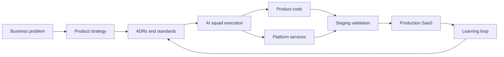
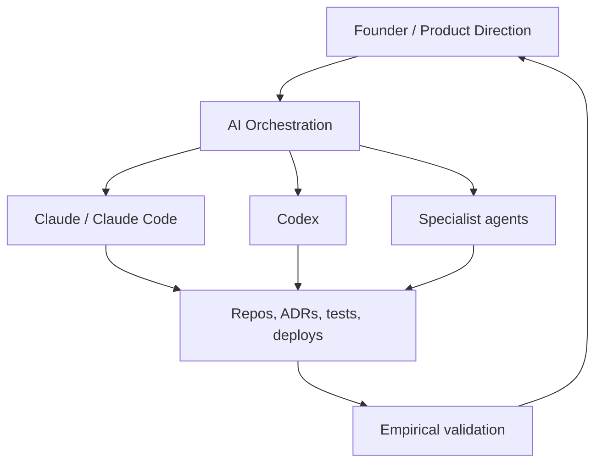

<div align="center">

# Fernando Parreiras

### AI Systems Architect | Founder @ Trustyu.ai & Tech Human

I build AI-powered products, multi-agent systems, and platform infrastructure for real-world companies.

[](https://www.fernandoparreiras.com.br)
[](https://trustyu.ai)
[](https://github.com/TECH-HUMAN)
[](https://www.linkedin.com/in/fernandoparreiras)

</div>

---

## Builder Signal

I am building Trustyu as a vertical SaaS platform powered by AI squads, shared infrastructure, product-specific data isolation, and a repeatable launch methodology called JARVIS.

| Area | What I am building |
| --- | --- |
| AI product systems | Multi-agent workflows, RAG, LLM routing, evaluation, tracing, and human-in-the-loop operations |
| Platform architecture | Shared services, product isolation, tenant-aware systems, reusable CI/CD, and deployable product templates |
| Business infrastructure | CRM, onboarding, messaging, billing, observability, and operational intelligence |
| AI literacy | Practical frameworks for companies adopting AI with governance, ROI, and execution readiness |

## JARVIS

JARVIS is my product launch operating system: a way to move from idea to production SaaS with AI-assisted squads, documented architecture decisions, empirical validation, and cross-repo execution.



Core principles:

- Documents that operate like execution systems, not static notes
- Platform inheritance: decisions made once, reused across products
- Contract-first delivery with tests, smoke checks, and explicit release criteria
- Multi-agent collaboration between Claude, Claude Code, Codex, and other coding agents
- Empirical validation over assumptions, especially for infra, auth, LLM, and observability layers

## Platform Stack

### Product Foundation


### Backend, Data, and Infra


### AI, Agents, and LLM Tooling


## AI Architecture Rules I Use

| Complexity | Default choice | Use when |
| --- | --- | --- |
| Level 1 | Direct Anthropic SDK | Simple LLM calls, classification, extraction, short prompt chains |
| Level 2 | LangChain | RAG pipelines, retrievers, document processing, vector search |
| Level 3 | LangGraph | Stateful agents, conditional workflows, checkpointing, handoffs |
| Level 4 | Google ADK | Parent-child hierarchies, parallel fan-out, multi-agent consolidation |
| Level 5 | Anthropic Agent SDK | High-autonomy Claude-native agents, coding automation, deep research |

Rule of thumb: start with the simplest layer that solves the problem, then move up only when real constraints demand it.

## Multi-Agent Operating Model



I use AI agents as an execution layer, not as a novelty layer. The goal is simple: faster product iteration with stronger engineering discipline.

Operating standards:

- Named branches and explicit ownership for multi-agent work
- ADRs for architectural decisions
- RED/GREEN commits for contract-first implementation
- Tenant isolation checks in product logic
- Observability for agent workflows using tracing and analytics
- Secrets handled as operational risk, not convenience

## Active Building Themes

| Theme | Direction |
| --- | --- |
| Vertical SaaS | Repeatable product architecture for niche, high-context markets |
| Hub Agents | Shared AI engine with vertical isolation and reusable agent infrastructure |
| Trustyu CRM | AI-assisted CRM workflows, onboarding, messaging, and operational automation |
| AI Literacy | Governance readiness, use-case mapping, maturity models, and ROI frameworks |
| Humanized Technology | Systems that increase leverage without losing human judgment |

## Contribution Flow

<picture>
  <source media="(prefers-color-scheme: dark)" srcset="https://raw.githubusercontent.com/fernandoparreiras/fernandoparreiras/output/github-contribution-grid-snake-dark.svg" />
  <source media="(prefers-color-scheme: light)" srcset="https://raw.githubusercontent.com/fernandoparreiras/fernandoparreiras/output/github-contribution-grid-snake.svg" />
  
</picture>

## Public Work To Explore

- [Personal website](https://github.com/TECH-HUMAN/fernandoparreiras-website): positioning hub and personal site
- Tech Human playbooks: humanized technology, leadership, and AI adoption frameworks
- AI system designs: architecture notes for agents, RAG, and vertical SaaS platforms
- Prompt and evaluation patterns: reusable workflows for reliable AI execution

## Operating Principles

```text
Build useful things.
Make technology more human.
Turn complex systems into practical leverage.
Validate reality before scaling opinion.
```

---

<div align="center">

Founder. Builder. Systems thinker. Still human.

</div>
